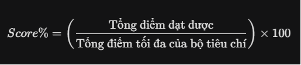

# BÁO CÁO PHÂN TÍCH SƠ BỘ DỰ ÁN IDEATRACK
## **1. Tổng quan Dự án**
- **Tên dự án:** IdeaTrack (Science Idea Management System).
- **Mục tiêu:** Số hóa quy trình đề xuất, xét duyệt và đánh giá các sáng kiến/ý tưởng khoa học trong môi trường đại học. Thay thế quy trình thủ công bằng hệ thống tự động, minh bạch và có tính tương tác cao.
## **2. Các Tác nhân chính (Actors)**
1. **Giảng viên (Author/Co-authors):** Tạo, chỉnh sửa nhóm, nộp hồ sơ, tải biểu mẫu và theo dõi kết quả.
1. **Lãnh đạo Khoa (Faculty Head):** Duyệt sơ bộ các hồ sơ thuộc khoa quản lý.
1. **Phòng Khoa học Công nghệ (OST):** Quản trị đợt, danh mục, hội đồng, tiêu chí; thực hiện sơ duyệt và ra quyết định cuối cùng.
1. **Hội đồng chấm điểm (Evaluation Board):** Các chuyên gia thực hiện chấm điểm dựa trên bộ tiêu chí định sẵn.
1. **Công chúng (Public):** Xem bảng xếp hạng vinh danh trên trang chủ.
## **3. Quy trình Nghiệp vụ Cốt lõi (Core Workflow)**
Hệ thống vận hành theo một luồng chuyển trạng thái nghiêm ngặt nhưng linh hoạt:

1. **Khởi tạo:** Giảng viên tạo bản nháp (Draft), mời đồng tác giả (Co-authors).
1. **Nộp hồ sơ:** Author chọn Đợt (Period) và Danh mục (Category).
1. **Sơ duyệt Cấp Khoa:** \* Duyệt -> Chuyển lên Phòng KHCN.
   1. Từ chối -> Sáng kiến kết thúc (có thể Copy sang bản nháp mới).
   1. Yêu cầu sửa (Revision) -> Tạm dừng luồng để Author cập nhật.
1. **Sơ duyệt Cấp Phòng (OST):** \* Khi OST nhấn "Đồng ý", hệ thống **tự động kích hoạt cơ chế Ghép cặp**: Gán Hội đồng cố định và Bộ tiêu chí theo Danh mục đã chọn.
1. **Đánh giá Đa vòng (Multi-round):** \* Hội đồng chấm điểm. PKHCN theo dõi điểm % thời gian thực.
   1. Nếu cần thẩm định lại, OST tạo Vòng mới (Round 2, 3...), giữ nguyên lịch sử vòng cũ.
1. **Quyết định cuối cùng:** OST phê duyệt kết quả, hệ thống chốt dữ liệu vào bảng FinalResults và hiển thị lên bảng xếp hạng.
## **4. Các Điểm nhấn Kỹ thuật & Logic đặc biệt**
### **A. Cơ chế "1-1-1" (Cấu hình Tự động)**
Hệ thống giảm tải tối đa cho quản trị viên thông qua mối liên kết:

- **1 Danh mục = 1 Hội đồng cố định = 1 Bộ tiêu chí.**
- Khi mở đợt mới, toàn bộ cấu trúc này được nhân bản (Clone) từ đợt cũ, chỉ cần điều chỉnh nếu có thay đổi nhân sự hoặc tiêu chí.
### **B. Đồng tác giả & Quyền chỉnh sửa**
- Chuyển đổi từ mô hình sở hữu đơn lẻ sang mô hình cộng tác.
- Bảng trung gian InitiativeAuthorship quản lý nhiều tác giả cho một sáng kiến, mọi tác giả đều có quyền sửa đổi như nhau.
### **C. Bảng xếp hạng Công khai (Public Leaderboard)**
- **Xếp hạng Sáng kiến:** Tính theo % điểm (Điểm đạt được / Điểm tối đa) để công bằng giữa các danh mục khác nhau.
- **Xếp hạng Giảng viên:** Tính theo tổng số lượng sáng kiến đã được Phê duyệt (Approved).
- **Công nghệ:** Sử dụng Supabase Storage để lưu trữ các file biểu mẫu (Reference Forms) và hồ sơ sáng kiến.
## **5. Cấu trúc Dữ liệu Sơ bộ (Entity Relationship)**
Hệ thống được xây dựng trên các thực thể chính sau:

- **Quản lý thời gian:** AcademicYear > InitiativePeriod > InitiativeCategory.
- **Quản lý đánh giá:** EvaluationBoard (Members), EvaluationTemplate (Criteria).
- **Thực thể trung tâm:** Initiative, InitiativeAuthorship, InitiativeAssignment.
- **Kết quả & Lịch sử:** EvaluationDetail (theo Round), FinalResults, RevisionRequest.
## **6. Chiến lược xử lý rủi ro (Edge Cases)**
- **Xử lý từ chối:** Không cho sửa trực tiếp trên bài bị Reject để giữ tính minh bạch, yêu cầu tạo bản sao (Copy-to-Draft).
- **Xử lý chấm lại:** Tạo vòng mới để không mất dữ liệu lịch sử của Hội đồng.
- **Xử lý Cascade Delete:** Sử dụng DeleteBehavior.Restrict trong Fluent API để tránh mất dữ liệu quan trọng khi xóa một User hoặc một Category.

**1. Cấu trúc Quản lý Thời gian và Danh mục**

Hệ thống quản lý theo cấu trúc phân cấp để đảm bảo tính tổ chức chặt chẽ:

- **Năm học (Academic Year):** Một năm học (ví dụ: 2024-2025) đóng vai trò là khung thời gian lớn nhất.
- **Đợt sáng kiến (Initiative Period):**
  - Một năm học có thể có nhiều đợt.
  - **Quy tắc:** Tại một thời điểm, chỉ có duy nhất **01 đợt** được mở (Active) để tiếp nhận hồ sơ.
- **Danh mục sáng kiến (Category):** \* Mỗi đợt sẽ có danh sách các danh mục riêng (ví dụ: Sáng kiến loại A, loại B).
  - Danh mục đóng vai trò là "mỏ neo" để hệ thống xác định Hội đồng và Tiêu chí chấm điểm tương ứng.
-----
**2. Trạng thái và Luồng hồ sơ (Workflow)**

Quy trình vòng đời sáng kiến gồm 5 giai đoạn chính:

**Giai đoạn 1: Khởi tạo & Nộp hồ sơ (Author)**

- **Bản nháp (Draft):** Khi giảng viên tạo bản nháp, hồ sơ chưa thuộc về đợt hay danh mục nào.
- **Nộp hồ sơ (Submit):** Khi thực hiện nộp, Author **bắt buộc** phải chọn:
  - Đợt sáng kiến hiện tại (đang mở).
  - Danh mục sáng kiến cụ thể trong đợt đó.
- **Mục tiêu:** Xác định đúng tuyến đường (Route) cho hồ sơ ngay từ đầu.

**Giai đoạn 2: Xét duyệt cấp Khoa (Faculty)**

- Lãnh đạo khoa xem xét nội dung sáng kiến.
- **Quyết định:** \* **Đồng ý:** Chuyển tiếp lên Phòng Khoa học Công nghệ (OST).
  - **Từ chối:** Hồ sơ dừng lại hoặc yêu cầu sửa đổi.

**Giai đoạn 3: Sơ duyệt & Ghép Hội đồng tự động (OST)**

- Phòng KHCN thực hiện sơ duyệt hồ sơ.
- **Cơ chế tự động:** Khi OST nhấn "Đồng ý", hệ thống tự động thực hiện:
  - Tra cứu danh mục mà Author đã chọn.
  - Gán **Hội đồng tương ứng** và **Bộ tiêu chí chấm điểm tương ứng** cho sáng kiến đó.
- **Quy tắc:** 1 Danh mục = 1 Hội đồng duy nhất = 1 Bộ tiêu chí duy nhất. Việc này giúp giảm bớt thao tác thủ công cấu hình cho từng hồ sơ đơn lẻ.

**Giai đoạn 4: Đánh giá chuyên môn (Council)**

- Các thành viên trong Hội đồng được gán sẽ thấy hồ sơ trong danh sách cần chấm.
- Thực hiện chấm điểm theo tiêu chí (Rubric) và để lại nhận xét chi tiết.
- Sau khi **tất cả** thành viên hội đồng hoàn tất, hệ thống sẽ tổng hợp dữ liệu.

**Giai đoạn 5: Quyết định cuối cùng (OST Final Decision)**

- Phòng KHCN truy cập Dashboard để xem kết quả tổng hợp của sáng kiến, bao gồm:
  - Điểm trung bình cuối cùng.
  - Các ý kiến đánh giá chi tiết từ từng thành viên hội đồng.
- **Quyết định cuối cùng:** OST thực hiện **Phê duyệt** (Công nhận sáng kiến) hoặc **Từ chối** kết quả dựa trên dữ liệu hội đồng đã cung cấp.
-----
**3. Các thực thể chính cần lưu ý trong Database**

Để phục vụ quy trình này, bạn cần chú ý các mối quan hệ:

1. **InitiativePeriod** ↔ **InitiativeCategory** (1-n).
1. **InitiativeCategory** ↔ **Board (Council)** (1-1).
1. **InitiativeCategory** ↔ **EvaluationTemplate (Criteria)** (1-1).
1. **Initiative** ↔ **InitiativeCategory** (Khóa ngoại để xác định luồng).

**Bảng tổng hợp Quyền hạn (Matrix)**

|**Tác nhân**|**Quyền chính**|**Giai đoạn**|
| :- | :- | :- |
|**Giảng viên**|Tạo, Sửa, Chọn danh mục & Nộp 15|Khởi tạo|
|**Lãnh đạo Khoa**|Xem, Duyệt hoặc Từ chối cấp cơ sở 16|Sàng lọc 1|
|**Phòng KHCN**|Sơ duyệt (kích hoạt ghép hội đồng), Quyết định cuối 17|Sàng lọc 2 & Kết thúc|
|**Hội đồng**|Chấm điểm & Nhận xét chuyên môn 18|Đánh giá|

# PHÂN TÍCH CHI TIẾT HỆ THỐNG IDEATRACK (BẢN TOÀN DIỆN)
## **1. Cơ chế Quản lý Đợt và Danh mục (Configuration)**
- **Đợt sáng kiến (Initiative Period):**
  - Admin (PKHCN) thực hiện đóng/mở thủ công. Tại một thời điểm chỉ có 1 đợt ở trạng thái Active.
  - **Logic sao chép:** Khi mở đợt mới, hệ thống tự động nhân bản (clone) các Danh mục từ đợt cũ sang đợt mới để giảm thiểu thao tác nhập liệu.
- **Danh mục (Category):**
  - Mỗi danh mục trong một đợt bắt buộc phải liên kết với: **01 Hội đồng (Board)** và **01 Bộ tiêu chí (Template)**.
  - Admin có thể tùy chỉnh: Chọn hội đồng/tiêu chí có sẵn hoặc lập mới hoàn toàn cho từng danh mục.
## **2. Luồng nộp bài và Chuyển đợt (Submission & Migration)**
- **Tính kế thừa:** Giảng viên (Author) có thể sử dụng các Bản nháp (Draft) được tạo từ các năm trước hoặc các đợt trước để nộp vào đợt đang mở hiện tại.
- **Tính linh hoạt:** Cho phép nộp lại các ý tưởng đã từng bị từ chối ở đợt cũ sang đợt mới (thông qua chức năng Copy-to-Draft).
## **3. Quản lý trạng thái và Xử lý Từ chối (Rejection & Revision)**
Hệ thống xử lý lỗi và từ chối theo 3 kịch bản:

|**Cấp phê duyệt**|**Hành động**|**Kết quả**|**Hướng xử lý cho Author**|
| :- | :- | :- | :- |
|**Khoa / PKHCN (Sơ duyệt)**|Từ chối (Reject)|Trạng thái: Rejected|Cho phép nhấn nút **"Tạo bản sao"** để copy toàn bộ nội dung sang một Draft mới để sửa và nộp lại vào đợt sau/danh mục khác.|
|**PKHCN (Quyết định cuối)**|Không đồng ý kết quả|Trạng thái: Re-evaluating|Hệ thống gửi thông báo yêu cầu Hội đồng thực hiện chấm điểm lại (Reset hoặc cập nhật điểm).|
|**Bất kỳ cấp nào**|Yêu cầu sửa (Revision)|Trạng thái: RevisionRequired|**Tạm dừng quy trình:** Hồ sơ trả về cho Author sửa. Sau khi Author nộp lại, quy trình tiếp tục ngay tại cấp đó mà không phải đi lại từ đầu.|

**4. Cơ chế Đánh giá và Chốt dữ liệu (Evaluation & Finalize)**

- **Theo dõi thời gian thực:** PKHCN có thể xem bảng tổng hợp điểm (điểm trung bình, nhận xét) ngay khi có ít nhất một thành viên hội đồng thực hiện chấm xong.
- **Điều kiện ra quyết định:** Nút "Phê duyệt cuối cùng" chỉ được kích hoạt (Enable) khi **100% thành viên** trong hội đồng đã xác nhận hoàn tất việc chấm điểm.
- **Lưu trữ vĩnh viễn:** Sau khi PKHCN nhấn Phê duyệt cuối cùng, một bản ghi sẽ được tạo vào bảng FinalResults.
  - *Mục đích:* Lưu lại "ảnh chụp" (snapshot) kết quả tại thời điểm đó. Nếu sau này hội đồng có thay đổi hoặc tiêu chí thay đổi, kết quả đã phê duyệt này vẫn không bị biến động.
-----
**5. Một số lưu ý về Kỹ thuật (Technical Notes)**

1. **Hàm Copy-to-Draft:** Cần viết một Logic chuyên biệt để Deep Copy (nhân bản toàn bộ thông tin bài viết + file đính kèm) sang một Id mới, gán Status = Draft và SubmittedDate = null.
1. **Logic "Ghép cặp tự động":** \* Khi Author chọn CategoryId và nhấn Submit, hệ thống sẽ lấy BoardId và TemplateId từ bảng Category để tạo ra các bản ghi trong bảng InitiativeAssignment.
1. **Bảng FinalResults:** Cần chứa các cột: InitiativeId, AverageScore, FinalRank (Xếp loại), FinalDecisionDate, và DecisionBy.
# CẬP NHẬT HỆ THỐNG: CẤU TRÚC HỘI ĐỒNG CỐ ĐỊNH
## **1. Mô hình Thực thể Hội đồng (Board Model)**
Thay vì tạo hội đồng rời rạc cho từng sáng kiến, chúng ta quản lý các "Nhóm chuyên gia" sẵn có:

- **Thực thể EvaluationBoard (Hội đồng):** \* Thuộc tính: Id, BoardName (VD: Hội đồng Kinh tế, Hội đồng Kỹ thuật), Description, IsActive.
  - Quan hệ: Một Hội đồng có nhiều Thành viên (BoardMembers).
- **Thực thể BoardMember (Thành viên hội đồng):**
  - Bảng trung gian nối EvaluationBoard và ApplicationUser.
  - Lưu vai trò trong hội đồng (Chủ tịch, Thư ký, Ủy viên) nếu cần.
## **2. Thiết lập tại Danh mục (Category Setup)**
Đây là "trái tim" của cơ chế tự động hóa:

- Mỗi **InitiativeCategory** sẽ giữ hai khóa ngoại quan trọng:
  - **BoardId**: Trỏ tới Hội đồng sẽ chấm danh mục này.
  - **TemplateId**: Trỏ tới bộ tiêu chí (Template) dùng để chấm.
- **Quy trình khi mở đợt mới:**
  - Admin nhấn "Mở đợt mới".
  - Hệ thống sao chép các Danh mục từ đợt cũ.
  - Các danh mục này **vẫn trỏ về Board và Template cũ**. Admin chỉ cần thay đổi nếu có sự điều chỉnh nhân sự hoặc cách chấm điểm mới.
## **3. Logic "Ghép cặp" tự động (Auto-Assignment Logic)**
Khi hồ sơ được PKHCN phê duyệt sơ duyệt (Status chuyển sang Evaluating):

1. Hệ thống kiểm tra CategoryId của sáng kiến.
1. Tìm ra BoardId tương ứng.
1. Tự động tạo bản ghi trong bảng InitiativeAssignment cho **tất cả thành viên** thuộc Hội đồng đó.
1. Gán TemplateId tương ứng vào từng bản ghi phân công.
## **4. Ưu điểm của phương án này**
- **Tốc độ:** PKHCN không phải chọn từng thầy cô cho hàng trăm hồ sơ.
- **Chính xác:** Loại bỏ việc gán nhầm người, nhầm bộ tiêu chí.
- **Dễ quản lý:** Nếu một thầy cô xin nghỉ, Admin chỉ cần xóa thầy đó khỏi EvaluationBoard, các sáng kiến nộp sau đó sẽ tự động không còn tên thầy nữa.
# CƠ CHẾ CHẤM ĐIỂM ĐA VÒNG (MULTI-ROUND EVALUATION)
## **1. Nguyên tắc hoạt động**
- **Tính toàn vẹn:** Điểm số và nhận xét của vòng trước **không bao giờ bị xóa hoặc ghi đè**.
- **Phân định bằng RoundNumber:** Mỗi lần PKHCN yêu cầu chấm lại, hệ thống sẽ tăng chỉ số vòng (Round 1 -> Round 2 -> Round n).
- **Trạng thái:** Chỉ có vòng hiện tại (vòng mới nhất) mới cho phép nhập điểm. Các vòng cũ sẽ chuyển sang chế độ "Chỉ xem" (Read-only).
## **2. Thay đổi cấu trúc dữ liệu (Database Schema)**
Để hỗ trợ cơ chế này, chúng ta cần bổ sung cột CurrentRound vào Sáng kiến và RoundNumber vào bảng Phân công:
### **Thực thể Initiative (Cập nhật)**
- **CurrentRound (int):** Mặc định là 1. Dùng để biết sáng kiến đang ở vòng chấm thứ mấy.
### **Thực thể InitiativeAssignment (Cập nhật quan trọng)**
- **RoundNumber (int):** Lưu số thứ tự vòng chấm của bản ghi này.
- **Logic:** Khi PKHCN nhấn "Chấm lại":
  - Hệ thống lấy CurrentRound hiện tại của sáng kiến (ví dụ: 1).
  - Tăng CurrentRound lên 2.
  - Tạo một bộ InitiativeAssignment mới cho cùng danh sách hội đồng đó với RoundNumber = 2.
  - Các EvaluationDetail (điểm chi tiết) sẽ được tạo mới và liên kết với các Assignment của Vòng 2.
-----
## **3. Quy trình thực hiện "Chấm lại" (Re-evaluation Workflow)**
1. **Kích hoạt:** PKHCN xem kết quả Vòng 1, thấy không đạt hoặc cần thẩm định lại -> Nhấn nút **"Yêu cầu chấm vòng tiếp theo"**.
1. **Hành động của hệ thống:**
   1. Chốt dữ liệu Vòng 1 (Khóa tất cả các bản ghi của Vòng 1).
   1. Tạo bản sao các bản phân công (Assignments) sang Vòng 2.
   1. Gửi thông báo (Email/Notification) cho Hội đồng: *"Sáng kiến [Tên] đã được mở vòng chấm thứ 2, vui lòng thực hiện đánh giá lại"*.
1. **Phía Hội đồng:** Khi đăng nhập, các thành viên sẽ thấy lịch sử chấm của chính mình ở Vòng 1 để tham khảo, sau đó nhập điểm mới cho Vòng 2.
1. **Phía PKHCN:** Dashboard sẽ hiển thị so sánh:
   1. Điểm TB Vòng 1: 75.5
   1. Điểm TB Vòng 2: 82.0
   1. **Biến động:** +6.5
-----
## **4. Tổng kết quan hệ giữa Đợt - Danh mục - Hội đồng - Vòng chấm**
Để bạn dễ hình dung sự phân cấp dữ liệu:

- **Năm học** (2024-2025)
  - **Đợt sáng kiến** (Đợt 1)
    - **Sáng kiến A** (Thuộc danh mục X)
      - **Vòng 1:** Hội đồng X chấm (Lưu lịch sử)
      - **Vòng 2:** Hội đồng X chấm (Kết quả cuối cùng)
    - **Sáng kiến B** (Thuộc danh mục Y)
      - **Vòng 1:** Hội đồng Y chấm (Xong - Approved)
# PHÂN TÍCH HỆ THỐNG TRUY VẾT (AUDIT LOG & HISTORY)
## **1. Triết lý thiết kế: "Ai - Làm gì - Khi nào - Thay đổi gì"**
Mọi tác động làm thay đổi dữ liệu (Create, Update, Delete, Change Status) đều phải được ghi lại. Đặc biệt, đối với các dữ liệu nhạy cảm như **Điểm số** và **Kinh phí**, hệ thống phải lưu được giá trị **Trước (Old Value)** và **Sau (New Value)** khi thay đổi.

-----
## **2. Chi tiết hoạt động cần log theo từng vai trò**
### **A. Nhóm Tác giả (Author / Co-authors)**
- **Khởi tạo/Chỉnh sửa:** Lưu lại thời điểm tạo bài, thời điểm sửa nội dung (ghi chú rõ field nào bị sửa).
- **Quản lý nhóm:** Ghi lại việc thêm hoặc xóa một đồng tác giả.
- **Tương tác File:** Thời điểm upload hoặc xóa file trên Supabase.
- **Nộp bài:** Ghi lại chính xác giây phút nhấn nút Submit.
### **B. Lãnh đạo Khoa (Faculty)**
- **Xét duyệt:** Ghi lại trạng thái phê duyệt (Đồng ý/Từ chối/Yêu cầu sửa).
- **Nội dung phản hồi:** Lưu lại toàn bộ nội dung text mà Khoa đã nhận xét để đối chiếu sau này.
### **C. Hội đồng chấm điểm (Council/Reviewer)**
- **Chấm điểm:** Lưu lại thời điểm bắt đầu chấm và thời điểm nhấn "Hoàn thành".
- **Sửa điểm (Nếu có):** Trong trường hợp được phép sửa, hệ thống phải lưu lại: *"Thầy A đã sửa tiêu chí 1 từ 8đ thành 9đ vào lúc..."*
- **Lịch sử Vòng (Round):** Log lại việc xem dữ liệu vòng cũ trước khi chấm vòng mới.
### **D. Phòng Khoa học Công nghệ (PKHCN)**
- **Cấu hình:** Ghi lại việc thay đổi thành viên hội đồng, thay đổi bộ tiêu chí của danh mục.
- **Sơ duyệt:** Ghi lại thao tác gán hội đồng tự động.
- **Quyết định cuối:** Ghi lại thời điểm chốt kết quả và người thực hiện phê duyệt kinh phí.
-----
# CẬP NHẬT HỆ THỐNG: BIỂU MẪU & BẢNG XẾP HẠNG
## **1. Quản lý Biểu mẫu hướng dẫn (Reference Forms)**
Để giảng viên không phải tự bơi, mỗi Đợt sáng kiến sẽ đi kèm một bộ tài liệu mẫu.

- **Thực thể ReferenceForm:**
  - Thuộc tính: Id, FormName, FileUrl (đường dẫn lưu file docx, pdf, xlsx), Description, PeriodId.
- **Cơ chế hoạt động:**
  - **Mặc định:** Khi tạo Đợt mới, hệ thống tự động copy danh sách ReferenceForm từ Đợt cũ sang.
  - **Chỉnh sửa:** PKHCN có thể upload file mới, xóa file cũ hoặc sửa mô tả cho phù hợp với yêu cầu riêng của từng đợt.
  - **Phía Author:** Khi truy cập trang chủ hoặc trang nộp bài, giảng viên thấy danh sách "Tài liệu biểu mẫu" để tải về.
## **2. Hệ thống Xếp hạng (Leaderboard) trên HomePage**
Để giải quyết bài toán "so sánh quả cam với quả táo" (các danh mục có bộ tiêu chí và tổng điểm khác nhau), phương án **tính theo tỷ lệ %** là cực kỳ chính xác.
### **2.1. Công thức tính điểm chuẩn hóa (Normalized Score)**
Điểm dùng để xếp hạng sẽ không dùng điểm thô (Raw Score) mà dùng điểm phần trăm:

- **Ví dụ:** \* Sáng kiến A (Danh mục X): Chấm được 80/100 điểm $\rightarrow$ 80%.
  - Sáng kiến B (Danh mục Y): Chấm được 45/50 điểm $\rightarrow$ 90%.
  - **Kết quả:** Sáng kiến B xếp trên sáng kiến A.
### **2.2. Hai loại bảng xếp hạng**
1. **Top Sáng kiến:** Hiển thị danh sách các sáng kiến có % điểm cao nhất trong đợt/năm.
1. **Top Giảng viên (Vinh danh):** Dựa trên thành tích của giảng viên.
# CẬP NHẬT HỆ THỐNG: BIỂU MẪU, XẾP HẠNG & ĐỒNG TÁC GIẢ
## **1. Quản lý Biểu mẫu (Reference Forms)**
- **Phạm vi:** Dùng chung cho toàn bộ các danh mục trong cùng một đợt sáng kiến.
- **Cơ chế lưu trữ:** File được lưu trên **Supabase Storage**. Database chỉ lưu URL dẫn đến file đó.
- **Tính kế thừa:** Khi PKHCN mở đợt mới, hệ thống tự động copy các bản ghi (tên file và URL) từ đợt cũ sang đợt mới.
## **2. Hệ thống Xếp hạng (Public Leaderboard)**
- **Đối tượng xem:** Công khai (Public) – bất kỳ ai truy cập website đều có thể xem bảng xếp hạng mà không cần đăng nhập.
- **Dữ liệu hiển thị:** Tên sáng kiến/giảng viên, điểm số (%) và thứ hạng.
- **Phân loại xếp hạng:**
  - **Xếp hạng Sáng kiến:** Dựa trên **Điểm phần trăm (%)** (Điểm đạt được / Điểm tối đa của bộ tiêu chí).
  - **Xếp hạng Giảng viên (Thành tích tích lũy):** Tính theo **Tổng số lượng sáng kiến được Phê duyệt (Approved)**. Giảng viên nào có nhiều sáng kiến "về đích" nhất sẽ đứng đầu.
- **Bộ lọc (Filter):**
  - Theo Đợt hiện tại (Mặc định).
  - Theo Năm học.
  - Toàn thời gian (All-time).
## **3. Cơ chế Đồng tác giả (Multi-author Collaboration)**
Đây là thay đổi quan trọng về cấu trúc quan hệ người dùng và sáng kiến.

- **Mô hình dữ liệu:** Thay vì quan hệ 1-N (Một user - Nhiều sáng kiến), chúng ta chuyển sang quan hệ **N-N (Nhiều user - Nhiều sáng kiến)**.
- **Bảng trung gian InitiativeAuthorship:**
  - Cột: InitiativeId, AuthorId, IsCreator (để biết ai là người tạo bản đầu tiên).
- **Quyền hạn:** \* Mọi thành viên trong danh sách tác giả đều có quyền **Xem và Chỉnh sửa** ngang nhau (khi sáng kiến ở trạng thái cho phép sửa như Draft hoặc Revision).
  - Giảng viên tạo sáng kiến có chức năng "Thêm đồng tác giả" bằng cách tìm kiếm theo tên/email/mã giảng viên.
# TỔNG HỢP CHỨC NĂNG & GIAO DIỆN: GIẢNG VIÊN (AUTHOR)
## **1. Giao diện Trang chủ (Public HomePage)**
Đây là nơi giảng viên tiếp cận hệ thống đầu tiên, kể cả khi chưa đăng nhập.

- **Tải Biểu mẫu (Reference Forms):** Danh sách các file hướng dẫn (docx, pdf, excel) của đợt hiện tại được lưu trên Supabase. Giảng viên nhấn để tải về bám theo cấu trúc.
- **Bảng xếp hạng (Leaderboard):** \* **Top Sáng kiến:** Hiển thị tên sáng kiến, đại diện tác giả và điểm số %.
  - **Top Giảng viên:** Vinh danh những người có nhiều sáng kiến được duyệt nhất (tích lũy).
- **Bộ lọc BXH:** Cho phép xem theo Đợt, Năm học hoặc Toàn thời gian.
-----
## **2. Dashboard Cá nhân (My Initiatives)**
Giao diện quản lý tập trung tất cả các "đứa con tinh thần" của giảng viên.

- **Danh sách sáng kiến:** Hiển thị lưới (Grid) hoặc bảng (Table) các sáng kiến mà giảng viên đó là tác giả hoặc đồng tác giả.
- **Bộ lọc trạng thái:** Lọc nhanh các bài đang là Draft, Evaluating (Đang chấm), Approved (Đã duyệt), hoặc Rejected (Bị từ chối).
- **Chức năng "Tạo bản sao" (Copy to Draft):** Đối với các sáng kiến bị Rejected từ đợt trước hoặc cấp trước, giảng viên nhấn nút này để hệ thống tự động copy nội dung sang một bản nháp mới để sửa và nộp lại.
-----
## **3. Giao diện Soạn thảo & Nộp bài (Creation & Collaboration)**
Đây là khu vực quan trọng nhất, nơi giảng viên nhập liệu.

- **Thông tin chung:** Tên sáng kiến, mô tả, ngân sách dự kiến.
- **Quản lý Đồng tác giả (Co-authors):** \* Ô tìm kiếm giảng viên khác để thêm vào nhóm.
  - Danh sách tác giả hiện tại (Ai cũng có quyền chỉnh sửa như nhau).
- **Chọn Đợt & Danh mục:** \* Hệ thống tự động hiển thị đợt đang Active.
  - Giảng viên bắt buộc chọn 1 **Danh mục** (để hệ thống tự biết hội đồng nào sẽ chấm).
- **Upload hồ sơ:** Tải các file thuyết minh lên **Supabase Storage**.
- **Lưu nháp vs Nộp:** Cho phép lưu lại để làm việc nhóm tiếp hoặc nộp chính thức.
-----
## **4. Giao diện Theo dõi & Phản hồi (Tracking & Revision)**
Giảng viên không còn bị "mù thông tin" về lộ trình của bài viết.

- **Tiến độ (Timeline):** Hiển thị trực quan bài đang ở bước nào (Khoa -> Sơ duyệt -> Hội đồng).
- **Yêu cầu chỉnh sửa (Revision Request):** \* Nếu Khoa hoặc PKHCN yêu cầu sửa, giao diện sẽ hiện thông báo nổi bật kèm **Nội dung yêu cầu** và **Deadline**.
  - Nút "Nộp lại" sẽ xuất hiện sau khi giảng viên đã cập nhật nội dung.
- **Xem lịch sử chấm điểm (Evaluation History):** \* Đối với các sáng kiến đang ở bước Quyết định cuối hoặc đã hoàn tất, giảng viên có thể xem nhận xét của hội đồng (nếu PKHCN cho phép công khai).
  - Xem điểm số qua các vòng (Round 1, Round 2...).
-----
## **5. Bảng tóm tắt Hành động theo Trạng thái**

|**Trạng thái hồ sơ**|**Quyền của Giảng viên**|
| :- | :- |
|**Draft (Nháp)**|Chỉnh sửa, Xóa, Thêm đồng tác giả, Nộp.|
|**Pending (Chờ duyệt)**|Chỉ xem, không được sửa.|
|**Revision Required**|Được quyền chỉnh sửa lại nội dung và nộp lại.|
|**Evaluating**|Xem tiến độ (đang ở hội đồng nào), không được sửa.|
|**Rejected**|Xem lý do từ chối, nhấn "Tạo bản sao" để làm lại.|
|**Approved**|Xem kết quả cuối cùng, điểm % và thứ hạng.|

# TỔNG HỢP CHỨC NĂNG & GIAO DIỆN: LÃNH ĐẠO KHOA
## **1. Giao diện Dashboard (Phê duyệt Hồ sơ)**
Đây là màn hình làm việc chính khi Lãnh đạo Khoa đăng nhập để xử lý các yêu cầu mới.

- **Danh sách hồ sơ chờ duyệt:** Hiển thị danh sách các sáng kiến của giảng viên thuộc Khoa vừa mới nộp.
- **Thông tin tóm tắt:** Tên sáng kiến, danh sách đồng tác giả, đợt nộp, ngày nộp.
- **Cảnh báo Deadline:** Đánh dấu các hồ sơ đã nằm chờ quá lâu mà chưa được xử lý.
## **2. Giao diện Chi tiết & Ra quyết định**
Khi click vào một hồ sơ, Lãnh đạo Khoa sẽ xem toàn bộ nội dung để đánh giá chuyên môn.

- **Xem hồ sơ đầy đủ:** Đọc nội dung thuyết minh, xem dự toán kinh phí và các tệp đính kèm (mở file trực tiếp từ Supabase).
- **Danh sách đồng tác giả:** Xem thông tin tất cả giảng viên tham gia để đánh giá nguồn lực thực hiện.
- **Panel Quyết định (3 lựa chọn quan trọng):**
  - **Đồng ý (Approve):** Xác nhận hồ sơ hợp lệ về chuyên môn. Trạng thái chuyển sang Chờ sơ duyệt cấp Trường.
  - **Từ chối (Reject):** Chấm dứt hồ sơ. Bắt buộc nhập **Lý do từ chối**. (Lúc này Author sẽ thấy nút "Tạo bản sao" để làm lại bản khác).
  - **Yêu cầu chỉnh sửa (Revision):** Nhập nội dung cần sửa. Hồ sơ trả về cho nhóm tác giả, quy trình tại Khoa tạm dừng cho đến khi giảng viên nộp lại bản cập nhật.
## **3. Giao diện Theo dõi Tiến độ (Faculty Repository)**
Khoa cần nắm bắt tình hình nghiên cứu khoa học của đơn vị mình.

- **Kho lưu trữ sáng kiến:** Xem lại tất cả hồ sơ của Khoa từ trước đến nay (kể cả những bài đã chuyển lên cấp Trường).
- **Theo dõi trạng thái thực tế:** Lãnh đạo Khoa có thể biết sáng kiến của giáo viên mình đang ở bước nào (Đang chấm vòng 1, Đang chấm vòng 2, hay đã có Kết quả cuối cùng). Điều này giúp Khoa đôn đốc giảng viên.
- **Lịch sử chỉnh sửa (Audit Log):** Xem các phiên bản đã thay đổi của sáng kiến khi có yêu cầu Revision.
## **4. Giao diện Báo cáo & Thống kê Khoa**
- **Thống kê theo Đợt:** Tổng số sáng kiến của Khoa đã nộp, tỷ lệ được duyệt so với các Khoa khác.
- **Xếp hạng nội bộ:** Xem giảng viên nào trong Khoa đang có thành tích tích lũy cao nhất (phục vụ công tác thi đua khen thưởng cấp cơ sở).
## **5. Bảng ma trận hành động của Khoa**

|**Hành động**|**Điều kiện**|**Kết quả hệ thống**|
| :- | :- | :- |
|**Phê duyệt**|Sáng kiến phù hợp định hướng chuyên môn của Khoa.|Chuyển trạng thái sang Waiting for OST Screening.|
|**Từ chối**|Sáng kiến không khả thi hoặc vi phạm quy định.|Chuyển trạng thái sang Rejected. Gửi thông báo cho toàn bộ nhóm tác giả.|
|**Yêu cầu sửa**|Sáng kiến cần làm rõ kinh phí hoặc chỉnh sửa nội dung.|Chuyển trạng thái sang Revision Required. Mở lại quyền edit cho Author.|
## **6. Các quy tắc đặc thù cần lưu ý khi thiết kế**
1. **Phạm vi dữ liệu (Data Scope):** Lãnh đạo Khoa A **chỉ thấy** sáng kiến của giảng viên thuộc Khoa A. Không được xem bài của Khoa khác để đảm bảo tính bảo mật chuyên môn (trừ khi họ là thành viên Hội đồng được PKHCN mời chấm chéo).
1. **Tính đơn giản (Usability):** Giao diện duyệt cho Khoa cần tối giản (Clean UI). Thường chỉ gồm nội dung bài viết bên trái và cột nhận xét/nút bấm bên phải để Lãnh đạo dễ dàng tập trung đánh giá.
1. **Thông báo (Notification):** \* Khi có giảng viên nhấn "Nộp", Lãnh đạo Khoa nhận Email/Thông báo hệ thống ngay lập tức.
   1. Khi PKHCN ra quyết định cuối cùng (Duyệt/Hủy), Khoa cũng nhận được thông báo để cập nhật tình hình của đơn vị.
# TỔNG HỢP CHỨC NĂNG & GIAO DIỆN: PHÒNG KHOA HỌC CÔNG NGHỆ
## **1. Giao diện Quản lý Cấu trúc (Configuration Center)**
Đây là nơi PKHCN thiết lập "luật chơi" cho toàn hệ thống.

- **Quản lý Năm học & Đợt sáng kiến:** \* Tạo năm học mới, đóng/mở đợt sáng kiến thủ công.
  - Chức năng **Clone Data**: Tự động sao chép Danh mục và Biểu mẫu từ đợt cũ sang đợt mới.
- **Quản lý Danh mục (Categories):** \* Thiết lập mối quan hệ **1-1-1**: Chọn 01 Hội đồng và 01 Bộ tiêu chí cho mỗi Danh mục.
- **Quản lý Biểu mẫu (Reference Forms):** \* Upload/Cập nhật các file hướng dẫn lên **Supabase**. Giảng viên sẽ thấy các file này để tải về.
-----
## **2. Giao diện Quản lý Hội đồng & Tiêu chí (Master Data)**
- **Quản lý Hội đồng (Evaluation Boards):**
  - Định nghĩa các hội đồng cố định (VD: Hội đồng Kỹ thuật, Hội đồng Ngôn ngữ).
  - Thêm/Xóa thành viên vào hội đồng (Chủ tịch, Thư ký, Ủy viên).
- **Quản lý Bộ tiêu chí (Evaluation Templates):**
  - Thiết kế Rubric chấm điểm: Tên tiêu chí, mô tả, điểm tối đa, trọng số.
  - Hệ thống tự động tính tổng điểm tối đa để làm cơ sở tính điểm %.
-----
## **3. Giao diện Sơ duyệt & Kích hoạt Luồng (Screening)**
Sau khi Khoa đã duyệt, hồ sơ sẽ đổ về đây.

- **Danh sách sơ duyệt:** Hiển thị toàn bộ sáng kiến đã qua cửa ải cấp Khoa.
- **Hành động Sơ duyệt:** 1. **Đồng ý:** Hệ thống tự động dựa vào Danh mục để gán Hội đồng và Tiêu chí (Auto-assign). Trạng thái chuyển sang Evaluating. 2. **Từ chối:** Kết thúc hồ sơ (giống cấp Khoa). 3. **Yêu cầu sửa (Revision):** Trả về cho giảng viên bổ sung thông tin.
-----
## **4. Giao diện Giám sát & Quyết định cuối (Final Decision)**
Đây là "Trung tâm điều khiển" khi các hội đồng đang làm việc.

- **Bảng tổng hợp điểm Real-time:** \* Xem danh sách các thành viên hội đồng đã chấm/chưa chấm.
  - Xem điểm trung bình (tính theo %) và các nhận xét chi tiết ngay khi có người vừa nhập xong.
- **Quản lý Vòng chấm (Multi-round):** \* Nếu kết quả chưa thỏa đáng, PKHCN nhấn nút **"Yêu cầu chấm lại (Vòng mới)"**.
  - Hệ thống tự động khóa vòng cũ, mở vòng mới và thông báo cho hội đồng.
- **Phê duyệt cuối cùng:** \* Khi 100% hội đồng hoàn tất, PKHCN chọn **Approve** (Duyệt cấp kinh phí) hoặc **Reject** (Không phê duyệt kết quả).
  - Dữ liệu được snapshot vào bảng FinalResults.
-----
## **5. Giao diện Thống kê & Bảng xếp hạng (Analytics)**
- **Quản lý Leaderboard:** Kiểm soát các sáng kiến hiển thị trên trang chủ.
- **Báo cáo tổng hợp:** Xuất file Excel danh sách sáng kiến được duyệt, tổng kinh phí dự kiến, thống kê theo Khoa/Năm học.
- **Truy vết (Audit Logs):** Xem lịch sử toàn bộ tác động vào hệ thống (Ai đã sửa điểm? Ai đã đổi trạng thái hồ sơ? Ai cập nhật hồ sơ, thông tin gì?).
-----
## **6. Bảng tóm tắt quyền hạn của PKHCN**

|**Nhóm chức năng**|**Hành động chính**|**Tần suất**|
| :- | :- | :- |
|**Thiết lập**|Mở đợt, gán Hội đồng vào Danh mục, Upload biểu mẫu.|Đầu mỗi đợt.|
|**Điều phối**|Sơ duyệt bài từ Khoa gửi lên, kích hoạt tự động gán Hội đồng.|Thường xuyên.|
|**Giám sát**|Theo dõi tiến độ chấm điểm, mở Vòng chấm mới nếu cần.|Trong giai đoạn chấm.|
|**Kết thúc**|Ra quyết định cuối cùng, chốt danh sách vinh danh.|Cuối mỗi đợt.|
# TỔNG HỢP CHỨC NĂNG & GIAO DIỆN: HỘI ĐỒNG (REVIEWER)
## **1. Giao diện Danh sách công việc (Review Dashboard)**
Khi đăng nhập, Reviewer sẽ thấy ngay danh sách các hồ sơ cần họ cho ý kiến chuyên môn.

- **Danh sách hồ sơ chờ chấm:** Hiển thị các sáng kiến thuộc Danh mục mà Hội đồng này được giao quản lý.
- **Bộ lọc thông minh:** Lọc theo Đợt, trạng thái (Chưa chấm/Đã chấm) và theo Vòng (Round 1, Round 2...).
- **Thời hạn (Deadline):** Hiển thị rõ ngày cuối cùng phải hoàn thành việc chấm điểm để tránh trễ tiến độ của Phòng KHCN.
-----
## **2. Giao diện Thẩm định & Chấm điểm (Evaluation Workspace)**
Đây là giao diện "chia đôi màn hình" (Split-screen) - kiểu thiết kế tối ưu nhất cho Reviewer:

- **Bên trái (Nội dung):** Hiển thị toàn bộ thuyết minh sáng kiến, danh sách tác giả và các file đính kèm (cho phép xem PDF trực tiếp trên trình duyệt hoặc tải về từ Supabase).
- **Bên phải (Phiếu điểm):** Hiển thị bộ tiêu chí chấm điểm (Rubric) được cấu hình cho danh mục đó.
  - **Nhập điểm:** Các ô input nhập điểm cho từng tiêu chí (có kiểm tra giới hạn điểm tối đa).
  - **Nhận xét chuyên môn:** Ô văn bản để viết đánh giá chi tiết cho từng tiêu chí hoặc nhận xét chung.
- **Tự động tính toán:** Hệ thống tự động cộng tổng điểm và quy đổi sang % ngay khi Reviewer nhập điểm để họ thấy được mức độ đánh giá của mình.
-----
## **3. Chức năng Quản lý Vòng chấm (Multi-round Review)**
Hỗ trợ cơ chế "Chấm lại" mà bạn đã yêu cầu:

- **Xem lịch sử vòng cũ:** Nếu đang ở Vòng 2, Reviewer sẽ thấy một tab "Lịch sử Vòng 1". Họ có thể xem lại điểm và nhận xét cũ của chính mình (chỉ xem, không sửa) để so sánh với bản cập nhật mới của giảng viên.
- **Cập nhật điểm vòng mới:** Reviewer thực hiện chấm điểm mới hoàn toàn trên các bản ghi của Vòng hiện tại.
-----
## **4. Chức năng Xác nhận & Hoàn tất**
- **Lưu tạm (Save Draft):** Cho phép Reviewer lưu lại kết quả đang chấm dở để hôm sau tiếp tục (PKHCN chưa thấy kết quả này).
- **Hoàn thành (Submit Evaluation):** Sau khi kiểm tra kỹ, Reviewer nhấn nút này để gửi kết quả chính thức.
  - **Lưu ý:** Sau khi đã nhấn "Hoàn thành", Reviewer **không được phép sửa điểm** nữa (trừ khi PKHCN mở lại Vòng mới). Điều này đảm bảo tính bảo mật và minh bạch.
-----
## **5. Giao diện Thống kê Cá nhân (Review History)**
- **Kho lưu trữ cá nhân:** Reviewer có thể xem lại danh sách tất cả các sáng kiến mình đã từng chấm trong quá khứ.
- **Thống kê hiệu suất:** Xem tổng số bài đã chấm trong năm học, số giờ/công sức đã đóng góp cho hoạt động thẩm định của trường.
-----
## **6. Bảng tóm tắt hành động của Reviewer**

|**Chức năng**|**Hành động chính**|**Tác động hệ thống**|
| :- | :- | :- |
|**Đọc hồ sơ**|Xem PDF, tải file từ Supabase.|Không đổi trạng thái.|
|**Chấm điểm**|Nhập điểm chi tiết + Nhận xét.|Tính toán điểm % tạm thời.|
|**Hoàn thành**|Nhấn "Submit Final".|Kích hoạt tính điểm trung bình cho PKHCN thấy.|
|**Xem lịch sử**|Xem lại Round cũ.|Phục vụ việc đánh giá sự tiến bộ của sáng kiến.|
##
